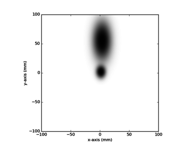
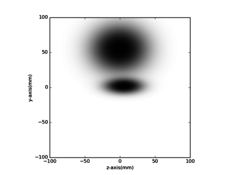
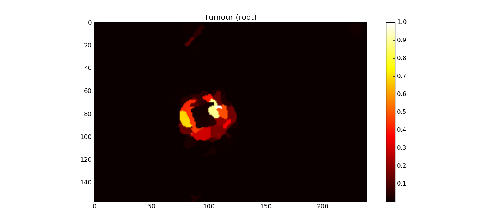

# Pieces-of-parts demo

Demo code to illustrate the improvement in the definition of a labelled region using spatial relationships between 
other regions in the supervoxel space. 

From publication:
Irving et al (2016).  
Pieces-of-parts for supervoxel segmentation with global context: Application to DCE-MRI tumour delineation. 
Medical Image Analysis, 21 (32), 69-83. 

## Build and run

**Build:**

```bash
python setup.py build_ext --inplace
```

**Run**

```bash
python pieces-of-parts-demo.py
```

## Results


*Learned probablities*




*Input probabilities associated with each label*


*Output probabilities for the tumour region*

